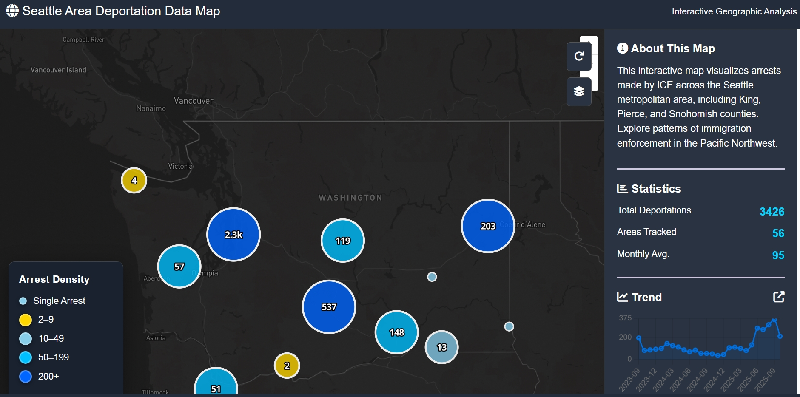
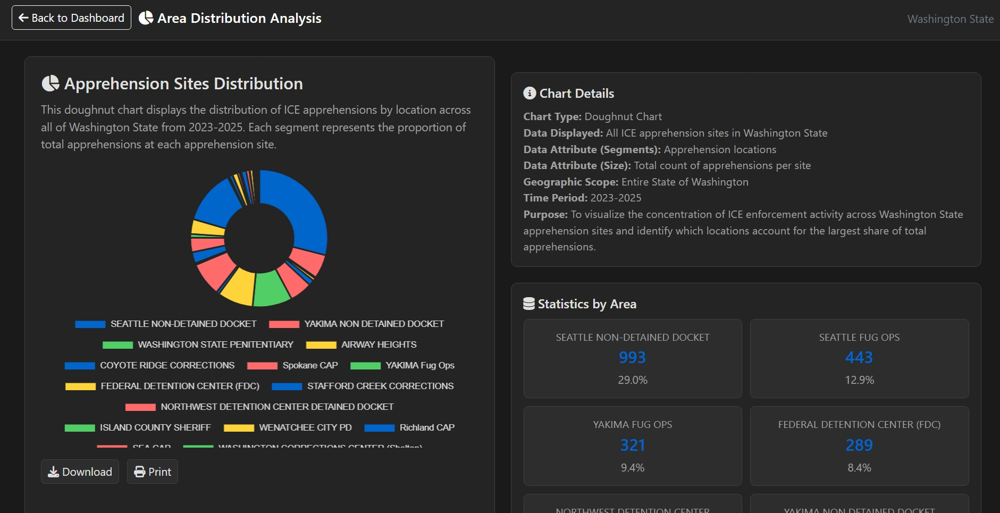

# Group 6 - Deportation in Washington State

## Project Title
Deportation in Washington State (Interactive Map)

## Project URL
https://github.com/farcoolius/group06_finalproject.git

## Team Members
- Cathya
- Farhan
- Irving
- Max

## Project Description
This project is an interactive web map that visualizes deportation rates across the United States, with an emphasis on Washington State (King, Pierce, Snohomish, and nearby counties). We provide total deportation counts, area counts, monthly averages, and geographic/hotspot analysis through Mapbox GL JS layers and Chart.js time-series visualizations.

## Project Goals
- Build an accessible visual tool for understanding deportation enforcement patterns.
- Enable users to identify hotspot clusters and compare regions at state/county levels.
- Encourage critical thinking about how immigration policies affect communities.
- Add context for data collection, cleaning, and interpretation for non-technical audiences.

## Features
- Interactive Mapbox GL JS map with point data and custom layers
- Heatmap/hotspot and choropleth visualization options
- Reset and layer toggles
- Info summary panel and charts for trends and category breakdowns
- Accessible dark theme UI

## Screenshots (sample)

## Data Sources
- [Deportation Data Project Data Portal](https://deportationdata.org/index.html)
- [Processed ICE Data](https://deportationdata.org/data/processed/ice.html)
- Local dataset: `assets/arrests-data.geojson`
- Local dataset: `assets/arrests-washington-only.csv`

## Applied Libraries and Services
- Mapbox GL JS (v2.15.0)
- Chart.js (v4.4.0)
- Bootstrap (v5.3.0)
- Font Awesome (v6.4.0)
- GitHub Pages deployment

## Other Notes
- Interactive layers and panels are in `index.html` / `js/main.js`.
- About page content in `about.html`.
- Static styling in `css/style.css`.

## Acknowledgment
Thank you to the Deportation Data Project for making processed deportation datasets publicly available. 

Esteemed permission from Washington State geographic data users and open-source contributors (Mapbox, Chart.js, Bootstrap).

---

### Contributors
Cathya, Farhan, Irving, Max

